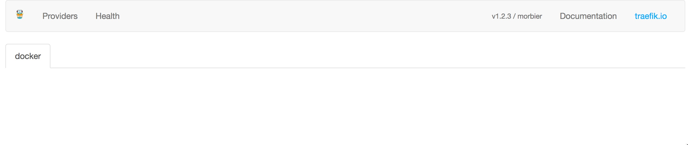
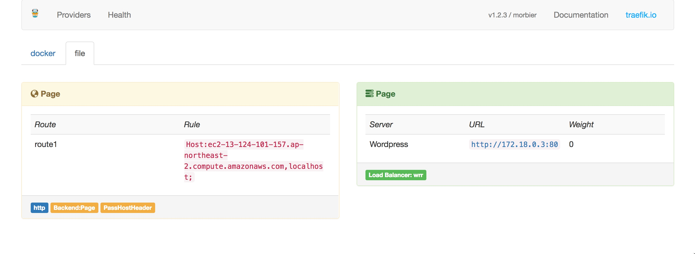
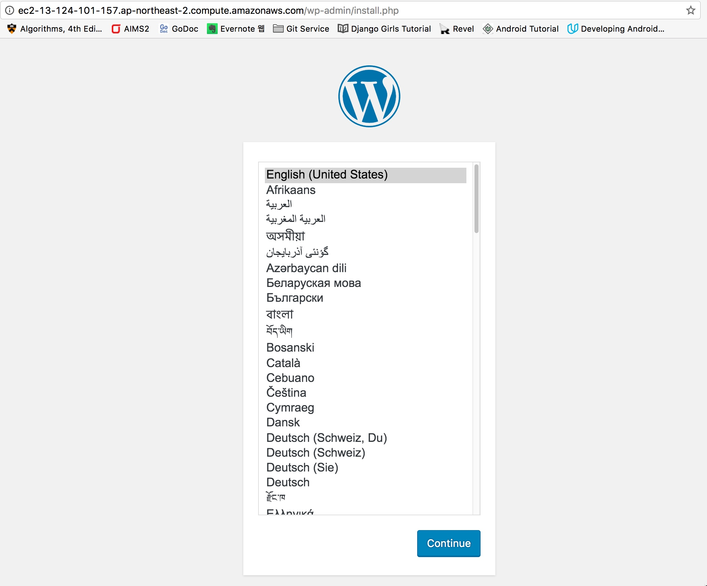

사실 학기초에 쓰려고 했던 것이지만, 다른 블로그 글을 쓰다보니 이 글을 먼저 써야할 것 같아서… 먼저 적게 됩니다. 😂😂


### 모든 일의 시작은 쓸데없이 나서기

올해 초, 저는 제가 들어가있는 학교 동아리에 하나 제안을 하게 됩니다.

> 중앙동아리 승격이 됐으니 서버를 본격적으로 운영해보자.
> 동아리만의 커뮤니티 페이지를 만들어보고, 특히 도커를 이용해서 동아리에서 나오는 프로젝트를 한 서버에서 동시에 호스팅해보자.

~네, 그렇게 저는 일을 벌렸습니다.~ 당시 저와 동아리 회장 친구가 도커뽕(?)에 취해있던 차에, 설치 후 근 2년동안 공식적으로 운영되오지 않았던 서버를 다시 활성화해보는 취지로 이런 제안을 하게 됩니다. 그래서 서로 이야기를 나누며 서버를 활용하는 방안을 4가지로 좁히게 됩니다.

1. Wordpress를 이용한 동아리 커뮤니티 페이지 운영
2. 향후 동아리 Slack 활용을 위한 자동 초대 페이지
3. 서버 호스팅이 가능한 프로젝트~(가령 웹이나, 웹이나 웹이나…)~를 일정기간 동안 호스팅 (포트폴리오 제공 차원)
4. 클라우드 환경 사용할 재원이 부족할 경우 (그럴 경우는 없지 않을까 하지만) 개발 환경 제공

각 안들은 도커 컨테이너에서 서비스가 제공이 되며, 접속은 단일 도메인에서 뒤에 붙는 경로를 통해 내부망으로 Forwarding해주는 방식으로 하고 싶었습니다. (가령 `http://example.com`은 워드프레스로,  `http://example.com/slack` 은 슬랙 자동 초대 페이지로) 그런데 전통적인 DNS 방식에 익숙해있던 저는 이를 어떻게 해야할지 좀 막막하더군요… 그러던 중 익명의 Golang 고수님으로부터 **Reverse Proxy**의 존재를 알게 됩니다

### Reverse Proxy? traefik?

보통의 Proxy는 내부에서 패킷을 받아 외부에 전달해주는 것으로 알고 있었습니다. 그러나 이것은 사실 Forward Proxy이고, 이와 반대로 외부에서 패킷을 받아 내부망에 전달해주는 Reverse Proxy가 있던 것입니다. 자세한 설명은 [여기](https://www.lesstif.com/pages/viewpage.action?pageId=21430345)에서! 대표적으로 Nginx, Haproxy, Apache에서 Reverse Proxy 기능을 사용하곤 합니다.

그러던 중, [traefik](http://traefik.io)를 알게 됐습니다. Golang(으로 짜여져 있고, Docker Backend를 기능적으로 지원해 `docker-compose.yml`의 `labels`를 통해 자동으로 설정을 적용이 가능하기 때문에 우선 사용해보기로 했습니다.

그래서 traefik을 Docker container로 받아서 리버스 프록시를 적용하기로 했습니다.

### traefik 초기 설정하기

먼저 traefik을 통해 Reverse Proxy 환경을 만들어줍니다. 쉬운 설정을 위해서 [`docker-compose`](https://docs.docker.com/compose/overview/)를 사용할 겁니다. traefik을 띄우기 위한 `docker-compose.yml`은 다음과 같습니다.

```toml
# traefik/docker-compose.yml
version: '2'

services:
  proxy:
    container_name: traefik_gateway
    image: traefik
    command: --web --docker --configFile=/etc/traefik/traefik.toml
    networks:
      - webgateway
    ports:
      - "80:80"
      - "8080:8080"
    volumes:
      - /var/run/docker.sock:/var/run/docker.sock
      - $PWD/traefik.toml:/traefik.toml

networks:
  webgateway:
    driver: bridge
```


위와 같이 하게 되면 Reverse Proxy의 설정은 `traefik.toml` 파일에서 정의하다는 것입니다. 우선 해당 파일은 나중에 정의하고, 다음 명령을 수행합니다. traefik 이미지가 있는 관계로 아래에는 이미지를 내려받는 과정은 생략되어 있습니다.

```shell
root@ip-172-31-4-218:/home/ubuntu/traefik# docker-compose --project-name=traefik up -d
Creating network "traefik_webgateway" with driver "bridge"
Creating traefik_gateway
```

Reverse Proxy를 위한 bridge network가 생성되고, 이를 이용한 traefik_gateway 컨테이너가 생성됩니다. 이제 8080 포트로 접근하면 다음과 같은 화면이 나오면 정상적으로 출력된 것입니다.



### Wordpress & MySQL 설치하기

이제 Wordpress와 MySQL을 설치할 겁니다. `docker-compose.yml`을 이용해 워드프레스를 올리기 전에, 현재 만들어져 있는 `traefik_webgateway`와는 별개의 네트워크를 만들 겁니다.

현재 `traefik_webgateway`는 80 포트와 8080 포트를 통해 외부에 개방되어 있는 상태입니다. 따라서, 만약 DB 서버를 이 네트워크에 연결할 경우, 잠재적으로 외부에 노출이 되기 때문에 보안 상의 이유로 따로 망을 만들어서 처리하기 위해서 입니다. 내부망은 명령어를 통해서 다음과 같이 만듭니다.

```shell
root@ip-172-31-4-218:/home/ubuntu/wordrepss# docker network create -d bridge backend_internal
04a9fb60a76fcbdf824f4ca8cc208a44dc113479a88627757144961dd112fd28
```

결과값은 생성된 네트워크에 대한 Hash값으로, 이렇게 정체불명의 숫자가 나오면 `backend_internal`이라는 이름으로 새로운 네트워크가 생성된 것입니다. 

이제 `docker-compose.yml`을 이용해서 Wordpress와 MySQL 인스턴스를 생성합니다. 각각의 컨테이너에 필요한 환경변수들은 `environment`에 들어가니 필요하신대로 변경하시기 바랍니다.

```toml
# wordpress/docker-compose.yml
version: '2'

services:
   db:
     container_name: Page_mysql
     image: mysql:5.7
     volumes:
       - db_data:/var/lib/mysql
     networks:
       - back-end
     restart: always
     environment:
       MYSQL_ROOT_PASSWORD: wordpress
       MYSQL_DATABASE: wordpress
       MYSQL_USER: wordpress
       MYSQL_PASSWORD: wordpress

   wordpress:
     container_name: Page_wp
     depends_on:
       - db
     image: wordpress/wordpress
     networks:
       - web
       - back-end
     restart: always
     environment:
       WORDPRESS_DB_HOST: db:3306
       WORDPRESS_DB_PASSWORD: wordpress

volumes:
    db_data:

networks:
  web:
    external:
      name: traefik_webgateway
  back-end:
    driver: bridge
```

이제 마찬가지로 `docker-compose up -d`명령어를 통해 컨테이너를 본격 생성합니다.

```shell
root@ip-172-31-4-218:/home/ubuntu/wordpress# docker-compose up -d
Creating Page_mysql
Creating Page_wp
```

### Routing Rule 설정하기

앞에서 이야기했던 것처럼, traefik은 설정파일을 바라보거나, Docker의 경우, Docker 컨테이너에 지정되어 있는 라벨들을 읽어 자동 설정하기도 합니다. 그러나 전자의 경우 파일이 변경되면, 매번 traefik 컨테이너를 새로 띄워 설정파일을 업데이트 해줘야하는 번거로움이 있습니다. 후자의 경우가 사실 새로운 컨테이너가 떴을 때 자동으로 설정할 수 있는 편안함이 있지만, 간혹가다 라벨로 인해 `docker-compose.yml`의 `environment` 항목이 무시되는 경우가 보였습니다. 따라서, 불편하지만 아직까지는 전자의 방법이 확실한 것 같아 전자의 방식으로 설명하려고 합니다.

`traefik.toml`의 기본적인 작성방법은 [여기](http://docs.traefik.io/basics/)에서 확인하실 수 있으며, 더 자세한 작성요령은 [여기](http://docs.traefik.io/toml/)서 확인하실 수 있습니다. 그 전에 워드프레스의 내부망 주소를 알아야합니다. 먼저 `docker inspect (컨테이너 해쉬값 혹은 이름)`를 통해 컨테이너 정보를 확인합니다.

```shell
root@ip-172-31-4-218:/home/ubuntu/docker-config/1.doitpage-config# docker inspect Page_wp
[
    {
        "Id": "dbe6fde408bcde189f79a0d800f8240543e9fbe0f0be220d16178286e4125131",
        "Created": "2017-05-03T10:30:56.275497836Z",
        "Path": "docker-entrypoint.sh",
...
            "Networks": {
                "backend_internal": {
...
                    "Gateway": "172.19.0.1",
                    "IPAddress": "172.19.0.3",
...
                },
                "traefik_webgateway": {
...
                    "Gateway": "172.18.0.1",
                    "IPAddress": "172.18.0.3",
...
```

장황한 상세정보가 나올텐데, 이 중에서 `Networks`을 확인해보면, 워드프레스 컨테이너가 두 개의 네트워크에 연결된 것을 확인할 수 있습니다. 이 중에서, `traefik_webgateway`에서의 IP 주소를 적어놓습니다.

이제 본격적으로 `traefik.toml`을 다음과 같이 작성합니다. 

```toml
# traefik.toml
logLevel = "DEBUG"
defaultEntryPoints = ["http"]
[entryPoints]
  [entryPoints.http]
  address = ":80"
[backends]
  [backends.(Traefik에서 사용할 백엔드 이름)]
    [backends.(Traefik에서 사용할 백엔드 이름).servers.Wordpress]
    url="http://172.18.0.3:80"

[frontends]
  [frontends.(traefik에서 사용할 프론트엔드 이름)]
  backend = "(traefik에서 사용할 백엔드 이름)"
  passHostHeader=true
    [frontends.(traefik에서 사용할 프론트엔드 이름).routes.route1]
    rule="Host:(접속하고자 하는 도메인 네임),localhost;"
```

적절한 이름들을 설정해주고 저장한 뒤, 컨테이너를 지우고 다시 띄우는 작업을 합니다. 컨테이너를 단순히 중지 시키고 다시 시작하는 것은 `traefik.toml` 파일을 새로 교체하지 않기에 완전히 삭제하는 것이 필요합니다. 따라서 다음과 같이 컨테이너를 삭제하고 다시 생성해줘야합니다. 

```shell
root@ip-172-31-4-218:/home/ubuntu/docker-config/0.traefik-setting# docker stop traefik_gateway
traefik_gateway
root@ip-172-31-4-218:/home/ubuntu/docker-config/0.traefik-setting# docker container rm traefik_gateway
traefik_gateway
```

이제 다음과 같이 컨테이너를 다시 생성해줍니다.

```shell
root@ip-172-31-4-218:/home/ubuntu/docker-config/0.traefik-setting# docker-compose --project_name traefik up -d
Creating traefik_gateway
```

그리고 다시 8080 포트로 접속하면 다음과 같이 `file`이라는 탭이 만들어지면서, 방금 전 정의해줬던 내용들을 확인할 수 있습니다.



이제 일반적인 화면으로 접속하면 워드프레스 설치화면을 확인할 수 있습니다.



다음에는 여러개의 마이크로 서비스를 서비스하는 방법에 대해 적도록 하겠습니다.